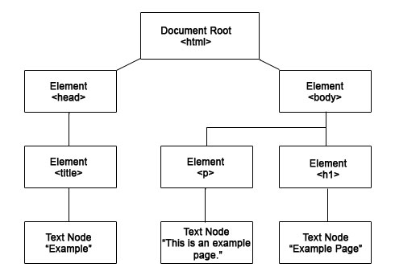

#  JavaScript 101

### LEARNING OBJECTIVES
*After this lesson, you will be able to:*

- Gain an overview of the JavaScript landscape and its placement in the web ecosystem.
- Practice programmatic thinking by writing pseudo-code.
- Write expressions that both assign and evaluate variables.
- Explain the difference between jQuery and vanilla JS.
- Register and trigger event handlers for jQuery events.  

### STUDENT PRE-WORK
*Before this lesson, you should:*

- Install [Sublime Text 3](https://www.sublimetext.com/3) on your computer.
- Have [Google Chrome](https://www.google.com/chrome/browser/desktop/) on your computer.
- Complete [DASH Project 1](https://dash.generalassemb.ly/projects/annas-website-1).

### INSTRUCTOR PREP
*Before this lesson, instructors will need to:*

- Have the starter code ready to go to hand out to students.
- Have students install Sublime Text 3 on to computer.
- Write learning objectives on board.
- Make sure wifi network and password (`GA Guest`, `yellowpencil`) is written on board, since students will need to be online to use [codepen.io](http://codepen.io/).


### LESSON GUIDE

| TIMING  | TYPE  | TOPIC  |
|:-:|---|---|
| 10 min  | [Opening](#opening)  | Greetings + The GA Experience  |
| 10 min  | [Introduction](#intro1)   | Web Production Workflow |
| 10 min  | [Introduction](#intro2)    | What is JavaScript?  |
| 15 min  | [Independent Practice](#ind-practice1)  | Practice Reading JavaScript |
| 5 min   | [Demo](#demo1)  | Pseudo Code|
| 15 min  | [Independent Practice](#ind-practice2)   | Thermostat |
| 10 min  | [Demo](#demo2)  | Variables and Data Types |
| 15 min  | [Guided Practice](#guided-practice1)  | Using the Console |
| 10 min  | [Demo](#demo3)  | Arithmetic Operators and Assignment Operators |
| 15 min  | [Guided/Independent Practice](#guided-practice2)  | Variables |
| 10 min  | [Demo](#demo4)  | Methods, JavaScript in Action |
| 5  min  | BREAK  |   |
| 10 min  | [Introduction](#intro3)  | jQuery, a JavaScript Library  |
| 15 min  | [Guided Practice/Independent Practice](#guided-practice3) | jQuery Codealong Part 1 |
| 10 min  | [Demo](#demo5) | jQuery Animations and Effects |
| 10 min  | [Guided/Independent Practice](#guided-practice3) | jQuery Codealong Part 2 |
| 10 min  | [Demo-Optional ](#guided-practice3) | jQuery + Conditionals |
| 5 min  | [Conclusion](#conclusion) | Review + Recap |

---

<a name="opening"></a>
## Opening: Greetings + The GA Experience (10 mins)

Did you know that there are over one billion websites that are live today? You're able to reach so many people by creating websites that distribute your ideas in a unique way. In this workshop, we'll be learning about the building blocks that will allow you to get creative and bring your ideas to life.

#### Review Learning Objectives

Let's start off by reviewing our learning objectives. First and foremost, we'll gain an overview of the JavaScript landscape. We'll also get to understand the importance of planning and writing out pseudocode (the actions or logic behind our applications). We'll then write some basic JavaScript code in our Chrome developer consoles as we learn about data types and variables. We'll also get into learning jQuery to see how we can add animations and effects to our websites.

#### Peer Introductions

>Instructor Note: Ask each student to share their first name and answer the following question: "What brought you here tonight?"

#### Materials

>Instructor Note: **You can distribute the starter code here to your class.**

***

<a name="intro1"></a>
## Introduction: Web Production Workflow (10 mins)

> Instructor Note: In the following section, students will learn about the differences between front and back end languages. Discuss the topics below.

The process of going from an idea to a fully developed and launched site is pretty cool! However, there are many components to building a website that allows for the type of functionality most clients seek today, like an e-commerce website. A "full stack" developer is someone who can work on both the back-end and front-end of a website. But what exactly do those terms mean? Let's take a closer look to help us understand the web production workflow.


- UX: user experience, UX designers try to make it as easy as possible for people to use a webpage while achieving the purpose of the webpage.
- Design: designers take the wireframes created by the UX team and make them pretty (think about color palettes, font families, etc).
- Front End: front end developers bring the designs to life with HTML, CSS, and our favorite, Javascript!
- Back End: back end developers give the website a "memory" with databases, user authentication, and more.

> Knowledge Check: Prompt students to define the terms and their differences. What questions do they have? Which leads into...

#### Front End vs Back End in More Detail:

Sometimes it can be challenging to describe how the front-end really differentiates from the back-end. Let's further illustrate the difference between the two.

- Front End: everything the user can *see* and *interact with* on a site.
- Back End:  everything the user does not see, but is *affected by*. This involves the database (which is basically a virtual spreadsheet that stores data), the server (a machine/computer that hosts web files), and any application logic (such as the validation of their username and password).

We'll mostly be focusing on JavaScript as a **front end language** in this lesson. So let's break down the THREE front end languages - HTML, CSS, and JavaScript.

- HTML = noun (responsible for the 'things' on the page, e.g image vs paragraph)
- CSS = adjective (responsible for styles like color or font family)
- JavaScript = verb (responsible for behaviors, like drop-down menus)

> Instructor Note: Some students may ask about Javascript as a back end language. Table these questions for now and return to them at the end of the session.

#### Activity


Let's go to [lyft.com](https://www.lyft.com/). When you hover over the word “Explore” in the navigation menu, or notice the dynamically looping hero images, you are seeing JavaScript in action.

Turn to the person next to you and together navigate some more through [lyft.com](https://www.lyft.com/). You can also choose another website like [yelp.com](http://www.yelp.com/) or [airbnb.com](https://www.airbnb.com/). With your partner discuss the following:

- Which parts of the site are front end and which are back end?


>Check: In summary, and in your own words, how would you describe how the front end is different from the back end of a website?

<a name="intro2"></a>
## Introduction: What is JavaScript? (10 mins)

So what exactly is JavaScript and what is it responsible for? To summarize, JavaScript can do a lot, including:

	- modify the behavior of content
	- create interactions and add functionality
	- animations
	- manipulating what we call the *DOM*

#### Let's review the DOM

In order for us to truly understand what JavaScript is and what it is used for, we need to first take a look at the DOM (Document Object Model). As we pointed out earlier, JavaScript is responsible for the behavior of content, interactions on the page, animations on the page and manipulating the DOM! Figuring out the DOM might sound intimidating at first, but not to worry! We've broken it down further here to illustrate how it's related to JavaScript.

> Instructor Note: Students should already have an understanding of the DOM so treat the content below as a mini-review.

The **Document Object Model (DOM)** is a collection of document nodes that are treated as objects in JavaScript. It is an object model and programming interface for HTML.



> Check: What is an object model? How does the document object model relate to Javascript?
> Instructor Note: Discuss and clear up any misconceptions here before moving on.

<a name="ind-practice1"></a>
## Independent Practice: Practice Reading JavaScript (15 mins)

Let's practice reading some JavaScript using this [codepen](http://codepen.io/nevan/pen/shtLA).

Visit the codepen together and:

1. Turn to someone next to you. As a team, try to figure out on a high level: what is happening?
2. With your partner, try to make it so that the `slow` button changes the bulb to yellow
3. With your partner, try to make it so that the `go` button works

This exercise is simply to help introduce you to what JavaScript looks like. Don't get caught up in all the details just yet!

> Instructor Note: When students finish, have one or two pairs share out their understanding of what is going on and what the JavaScript is doing. Then ask another pair to share their solution to changing the slow button bulb to yellow, and fixing the go button.

## Demo: Pseudo Code (5 mins)

Before we start writing any Javascript, we'll learn a bit about how to plan out your code by writing pseudocode. What is pseudocode? Well, to put in simple terms, it's a way to 'plan out' your program in plain English before coding it. This will make the coding process infinitely more seamless! Pseudocode serves as a detailed yet readable description of what a computer program must do.

Take, for example, a program that lets a player know whether he or she has passed the current level. Pseudocode for this program might look like the following:

```js

passingScore = 50 points
get playerScore


if playerScore >= passingScore
    display message "Current level: Passed"
otherwise
    display message "Current level: Failed"

```

Again, the goal is to think through the problem and break it down into simple steps, which can then be written out in code. Since there are no formal rules as to how pseudocode must be written, each person's version will likely vary slightly.

Programmers often use indentation to keep statements organized and grouped together.

> Check: "Why do you think it is important to plan out your program before coding it?"


<a name="ind-practice2"></a>
## Independent Practice: Thermostat (10 mins)


With a partner, write pseudocode for an application that would monitor the room temperature and adjust it so the room remains at a certain temperature.

1. Open up sublime
2. Type in your pseudocode in the text editor

Example answer:


```js
get targetTemperature
targetTemperature = 72
repeat forever

  currentTemperature = get sensor reading
  if currentTemperature < targetTemperature,
    turn on heater
  if currentTemperature >= targetTemperature,
    turn off heater
```


> Instructor Note: Walk through the problem and have a few students share what they come up with. At this point, students might not have the best idea of how to name variables in the pseudocode, but that's okay! Focus on the overall logic here.

<a name="demo2"></a>
## Demo: Variables and Data Types (10 minutes)

Now that we've learned a bit about pseudocode, let's begin to code! The first step to learning the fundamentals of JS involves learning to tell our program to remember (store) values. This helps us use them later on!

#### Variables

The 'container' we use to store a value is called a **variable**. Remember these properties of a variable:
- A variable has a **name** and a **value**.
- The value can change.

To **declare** a variable, we'll use the following syntax:

```javascript
var age = 29;
```

If you want to **reassign** a variable, which means change the value of a variable, you can do the following:

```javascript
var age = 29;
age = 30;

```


> Check: "If we keep going with the analogy of a 'container' or 'box', why does it work this way? How come you don't have to repeat the word `var`?"


> Answer: When you declare a variable, you create the box and you can store a value in there. When you want to swap out that value for another one, the box already exists.
</details>

#### Data Types

What can be stored in variables? There are three main data types or values that we'll want to learn about here.

**Strings**: groups of characters (either letters, numbers, or special characters like punctuation, spaces, or parentheses). They come in two varieties, 'single-quote' (also sometimes called 'string literals') and "double-quote". Though there are some differences between the two, don't worry about them for now. Strings are typically used to store text for people to read.

Examples: ```'hello'```, ```'goodbye'```, ```'moc.liamg@gmail.com'```

**Numbers**: can be positive, negative, decimals. Examples: ```20, -4.5, 300, 99.99```

**Booleans**: a data type that has a value of either ```true``` or ```false```

<a name="guided-practice1"></a>
## Guided Practice: Using the Console (15 minutes)

We'll be using the console to practice creating variables. It's where JavaScript is interpreted and run. You can use it to practice writing JavaScript!

1. Open up Google Chrome
2. Right click and go to "inspect"
3. Select "console"
5. Type the following:

```js
console.log("Hello!");
var name = "Susan";
name;
```

```js
var age = 18;
age;
```

To predict the types of data you're dealing with you can use ```typeof```.

```js
typeof 3.45;
```

```js
typeof true;
```


> Check: What data types did we store as the variable?

That's right: string and numbers! We'll also learn about *Booleans* later in this class.


<a name="demo3"></a>
## Demo: Arithmetic Operators and Assignment Operators (10 mins)

> Instructor Note: Discuss arithmetic operators and assignment operators from slides 28-29 with students.

We use operators to work with data in JavaScript. The standard arithmetic operators—which you have been learning since grade school are supported here, including addition, subtraction, division, and so forth. Check it out!

```js
2 + 4
=> 6

8 - 1
=> 7

4 / 2
=> 2

2 * 3
=> 6
```

Values are assigned using `=` Compound assignment statements, such as `+=` and `-=`, can also be used!

```js
var num = 8;
=> 8

num += 6
=> 14

num -= 6
=> 2
```

You can use `++` and `--` to increment and decrement by 1, respectively. These can be used as *prefix* or *postfix* operators.

>Check: To recap, we have discussed *two* types of values or objects that store data and offer helpful computation functions.


<a name="demo4"></a>
## Guided/Independent Practice: Variables (15 mins)

> Instructor Note: First, share this link with students and ask them to click on "View Raw" to download the starter code: https://github.com/generalassembly-studio/javascript-101-cwe-materials/blob/master/curriculum/02-materials/starter-code/starter-code.zip.  Be sure to walk students through opening the starter code.  During this demo you will be walking students through Part 1 of the "Variables" project. **Students will complete Part 2 on their own.** Students should type in their answers directly into the ```main.js``` file and use the console to test their answers.


Now it's your turn! Let's open the starter code in Sublime, located [here](https://github.com/generalassembly-studio/javascript-101-cwe-materials/blob/master/curriculum/02-materials/starter-code/starter-code.zip).

Try part one with me!

#### Part 1

- Declare a variable with the name "score". Assign it the value 3.  (Solution: `var score = 3;`)
- Update the value of score. The new value should be 6. (Solution: `score = 6;`)
- Use console.log to print out the value of score. (Solution: `console.log(score);`)
- Open up the index.html file in the browser Google Chrome. (Solution: `Since you are using Sublime Text 3, simply right click on the index.html file and select Open in Browser`)

### Part 2

Now, try the rest on your own:


1. Declare a variable with the name "totalAmount". Assign it the value 0.
2. Update the value of `totalAmount`. The new value should be 10.
3. Add five to the `totalAmount` using the `+=` operator.
4. Use `console.log` to print out the value of `totalAmount`.
5. Open up the index.html file in the browser Google Chrome. 

<a name="demo3"></a>
## Demo: JavaScript in Action (10 mins)

> Instructor Note: In this section you will be explaining on a high level what a JavaScript method is and how concatenation works. Go over slides 32-33.

A method in JavaScript is an action that can be performed on an object. We can make a string lowercase, uppercase or ask for the length of the string. For example, here we're making the string all lower case.


```js

		var str = "Hello World";
		var res = str.toLowerCase();
		// the result of res will be:
		// hello world
```

There are a lot more methods in JavaScript. You can find a whole list of methods and properties for strings [here](https://developer.mozilla.org/en-US/docs/Web/JavaScript/Reference/Methods_Index).  

We might also want to take two strings and combine or *concatenate* them. Concatenation simply means to take two strings and stick them together using the `+` operator, like so!

```js
		var book = "Happy";
		var summary = "Best book ever.";
		var review = book + ": " + summary;
		// Result will be: Happy: Best book ever.

```

<a name="intro3"></a>
## Introduction: jQuery, a JS Library (10 mins)

jQuery is an open-source project that was released in 2006, and it's currently the most widely used JavaScript library on the web. Originally, it was going to be called "JSelect", but the domain name "JSelect.com" was taken, so its creator, John Resig, decided to call it `jQuery` instead.

jQuery allows us to query (i.e. select elements from) the DOM using the exact same selector syntax that we've used in CSS. It makes it faster and easier to write cross-browser JavaScript and allows us to find elements using CSS-style selectors, and then do something to them using jQuery methods.

Here's some basic syntactical differences between javascript and jQuery:

Javascript:

```js
 document.getElementById('heading').innerHTML = "Your Name";
```

jQuery:

```js
  $('#heading').html('Your Name');

```

#### Loading jQuery

jQuery is a javascript file, but before you start using jQuery, you'll need to include it in our html page. Let's download the compressed version [online](https://jquery.com/download/). Alternatively, you can link to the jQuery file in the ```<script>``` tag in your HTML like so:

```html


<head>
	<script src="https://code.jquery.com/jquery-3.1.0.min.js"</script>
</head>


```

#### How Does jQuery Work?

To reiterate, here are some things jQuery can do:

- jQuery can be used to manipulate the DOM. Manipulating the DOM is possible because with jQuery you can:
	- select certain elements
	- work with these elements in some way
- You select an element by doing the following:

```js

$('li')     or      $('#firstParagraph')

```

The dollar sign specifies that you are using jQuery, what goes inside the parentheses and quotes is what you are selecting. As you can see, you can use your CSS-style selectors!

You manipulate or work with certain elements. For example, ```.addClass``` is a method that you would append to the selected object. In this example you are adding a class called 'about-me'.

```js
 .addClass('about-me');

```

In this example, you start by selecting the `h1` and then you append the method `.html` which will change the HTML content that is currently between the opening and closing `h1` tags.  

```js

$('h1').html('Content to insert goes here');

```

<a name="guided-practice3"></a>
## Guided/Independent Practice: jQuery Codealong Part 1 (15 mins)

> Instructor Note: Make sure your students have the [starter code](starter-code) that was distributed earlier in class. Ask students to follow along as you complete the "Together" piece of Part 1 in the jquery_ code_along project. Take them through the workflow:

Here are the steps to get started:

	- In Sublime, open the `jquery-code-along` project folder from starter code distributed earlier
	- Identify and add the script tags linking your external JavaScript file and linking the jQuery library

#### Part 1

1. Remove the highlight class from #box2 (use the ```.removeClass()``` method)

2. Select the anchor within #box3. Change the HTML to 'jQuery!'

<a name="ind-practice"></a>

#### Part 2

> Instructor Note: This can be a pair programming activity or done independently.

Here is the prompt for the deliverable:

1. Add the ```.highlight``` class to ```#box4``` (use the ```.addClass()``` method)

2. Make the text color of the strong tag within #box2 green (use the ```.css()``` method)


>Check: Were you able to create the desired deliverable(s)? Did it meet all necessary requirements / constraints?


<a name="demo"></a>
## Demo: jQuery Effects and Animations (10 mins)

- With jQuery you can also add effects and animations.
- Example:

```js
$('h1').fadeOut(200);

```

Additionally, with jQuery you can add what is called an **event listener**. This means that the browser is waiting for an event to occur, the event can be a mouseover or a scroll, for an action to be triggered.

For example:

```js
$('li').on('click', function() {
  // your code here
});

```

> Check: What is an event listener? What possible use cases can you think of for such a tool?

<a name="guided-practice4"></a>
## Guided Practice/Independent Practice: jQuery Codealong Part 2 (10 mins)

> Instructor Note: Make sure your students have the starter and solution code that was distributed in the beginning of class. Ask students to watch you as you complete the "Together" piece of Part 2 in the jquery_code_along project. Take them through the workflow:

Here are the steps to get started:

	- Open the entire project folder in editor (if closed)
	- Type out the solution as students watch you:

#### Part 1

1. When the anchor within #box3 is clicked:  
	- a) Slide toggle #box4
	- b) Fade out #box1 slowly

#### Part 2

> Instructor Note: This can be a pair programming activity or done independently.

Here is a prompt for the deliverable:

1. When the h2 is clicked on:
	- a) Slide up the h2
	- b) Add the snazzy class to the h1

2. When #box1 is clicked on:
	- a) Add the highlight class to h3


> Check: Were students able to create the desired deliverable(s)? Did it meet all necessary requirements / constraints?


<a name="demo6"></a>
## Demo: jQuery + Conditionals (10 mins)

> Instructor Notes: If time permits, go through conditionals in more detail in slides 54 - 63.

If something is true, do one thing. If it is not, do something else!

This type of logic or statement is a *condition*. In JavaScript (and coding in general), you'll need to make comparisons all the time:

- Is a user logged in?
- Has the user chosen three or more colors?
- Is the password correct?
- Does a user have enough money in their bank account?
etc.

Here's an example:

```javascript
if (age > 65) {
    $('h1').html("Senior Discount Applied");

} else if (age < 18) {
    $('h1').html("Student Discount Applied");

} else {
	  $('h1').html("Sorry, you don't qualify for a discount");
}

```

> Check: What is a conditional statement? What use cases can you think of for such a tool?

#### Part 3

We will now transition in to the last part of the jQuery-code-along project. The instructions read:


1. Create a variable and name it 'school'. Set the value of the variable equal to the prompt 'Which school are you at right now?'

2. Create a conditional statement where
	- if the value entered in to the prompt is equal to 'General Assembly', change the p tag in the footer to say 'Thanks for stopping by General Assembly!'
	- if user enters 'GA' change the p tag in the footer to say 'Thanks for stopping by GA!'
	- if user enters in anything else change the p tag in the footer to say 'Still the footer!'


<a name="conclusion"></a>
## Conclusion (5 mins)

So, who needs to know about this stuff? Everyone!  Even if you’re not the one doing the coding, being able to communicate effectively with developers and understand what’s going on behind the scenes of a product is a very important and highly valued skill in today’s job market.  

A couple of last things. You are going to get lots of errors. Don't get upset! This happens to everyone. Instead, try:

- Google first, ask questions later (but don't be afraid to ask)
- [Stack Overflow](http://stackoverflow.com) is great for this stuff!
- Get immersed!  Coding is hard if you don't get really involved (and practice everyday!).


> Instructor Note: Review independent practice deliverable(s) and distribute a link to the hand out
  - Go over the last slides which include a discussion on who needs to know the content covered in this class. If time permits you can cover what students can do after class or you can just let them know that they can reference the last couple of slides to find out.
  - Recap topic(s) covered in today's lesson.
> There are a few listed in the slides, but feel free to remove these slides, change them, or just tell students that they are there for their reference.
